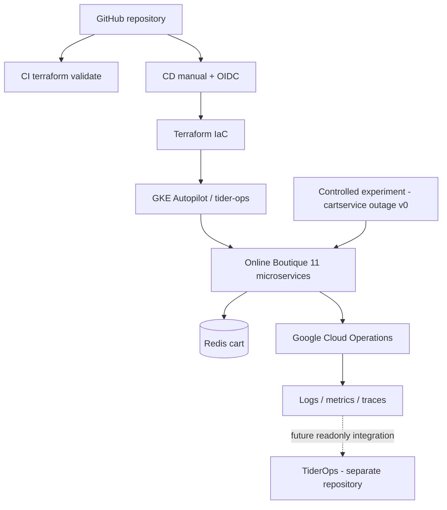

# ChaosForge architecture

```mermaid
flowchart TB
 GH[GitHub repository] --> CI[CI terraform validate]
 GH --> CD[CD manual + OIDC]
 CD --> TF[Terraform IaC]
 TF --> GKE[GKE Autopilot / tider-ops]
 GKE --> OB[Online Boutique 11 microservices]
 OB --> REDIS[(Redis cart)]
 OB --> OTEL[Google Cloud Operations]
 CHAOS[Controlled experiment - cartservice outage v0] --> OB
 OTEL --> EVID[Logs / metrics / traces]
 EVID -. future readonly integration .-> TIDER[TiderOps - separate repository]
```

NOTA: La capa TiderOps está fuera de este paquete. Cloud Operations proporciona integración; las trazas end-to-end deben verificarse tras desplegar.
